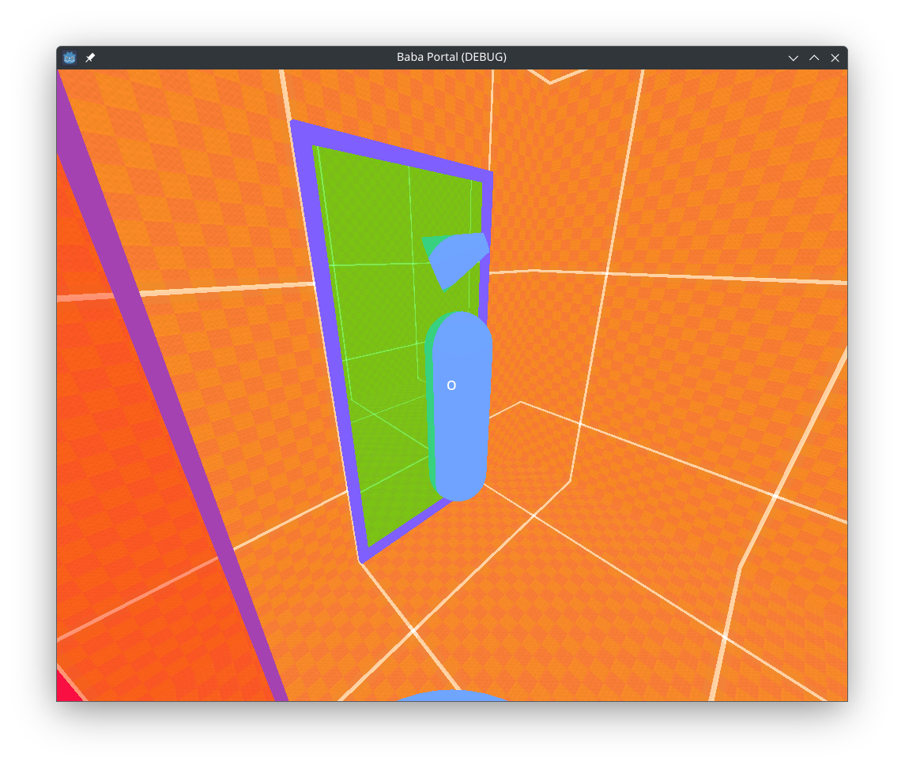

# Baba - Portal

This project explores genetic algorithms through an application to the game Geodash.


## About

It's ugly, but it works :D

Somes tricks :
* Since Godot doesn't allow to manipulate [camera's frustum](https://en.wikipedia.org/wiki/Viewing_frustum), I split the level structure in plates. Then I used instance layers to display or hide the plates from the differents couple camera/viewport that simulates the view through portals.
* I massively used shader to render the "view" through portals. Some glitch can happen if the camera is too close from the texture that render the view.

## Features

The player move using zqsd / wasd to move front or back and strafe left or right.
The mouse (captive) move the camera.
The left click create the red portal and the right click the blue portal. 
Escape quit the game.

There is no way to win. It's just a sandbox.

## Getting Started

### Prerequisites

- [Godot Engine 4.4](https://godotengine.org/download)

### Installation

1. **Clone the repository:**

	```
	git clone https://github.com/peebam/baba-portal
	```

2. **Open the project in Godot Engine 4.4.**

3. **Run the project.**
